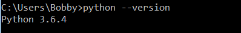
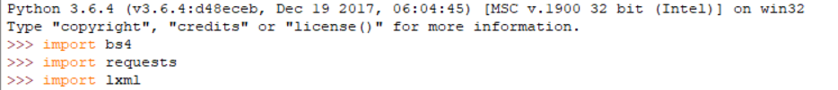

# Basics-of-Web-Scraping

## Steps for the installation in Windows:
- Open Command Prompt.
- Check whather the python 3 is installed or not.
- To check type **python --version** in command prompt and it will show the version as shown in the image below.

- If not install Python version 3.X from [here](https://www.python.org/downloads/).
- After Installing  Python, Install requests, bs4(Beautiful Soup) and lxml.
    Commands for installation:
    **pip install requests**
    **pip install bs4**
    **pip install lxml**

## Steps to do request to page and importing data
- Open python IDLE.
- import requestes using command **import requests**
- Similarly, import bs4 and lxml.

- After importing, make request to the site want to scrap and store it in the object.Just copy the URL of the webpage and type following command on the IDLE. Replace the single quote with the site you want to scrap.

